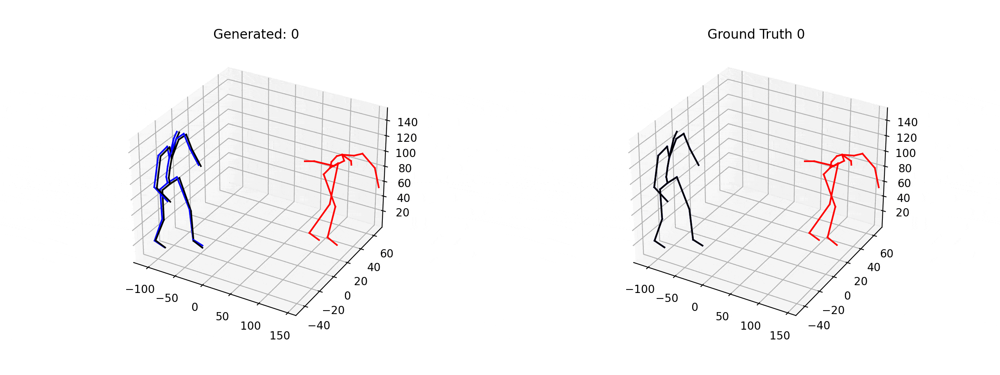
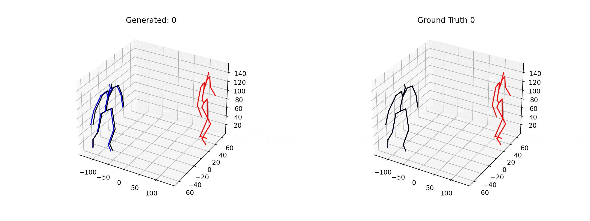

# Robust Motion In-betweening
> PyTorch Implementation of 'Robust Motion In-betweening'

   

It implements a paper [*"Robust Motion In-betweening"*](https://arxiv.org/abs/2102.04942).

[This article](https://montreal.ubisoft.com/en/automatic-in-betweening-for-faster-animation-authoring/) is a great source to understand authors intention and idea. This repo persues exact implementation of the paper, without tweaks and modifications.

## Setup

1. Follow [`LAFAN1`](https://github.com/ubisoft/ubisoft-laforge-animation-dataset) dataset's installation guide.
   *You need to install git lfs first before cloning the dataset repo.*
   Your directory will look like this:
   ```
   .
   |-- README.md
   |-- config
   |-- requirements.txt
   |-- rmi
   |-- test.py
   |-- tests
   |-- train.py
   `-- ubisoft-laforge-animation-dataset
   ```

2. Run `evaluate.py` to unzip and validate it. (Install `numpy` first if you don't have it)
   ```bash
   $ pip install numpy
   $ python ubisoft-laforge-animation-dataset/evaluate.py 
   ```
   With this, you will have unpacked LAFAN dataset under `ubisoft-laforge-animation-dataset` folder.

3. (Optional) You can use your own skeleton format as long as it fits with `TorchSkeleton` class. However, I recommend to use [`PyMO`](https://github.com/omimo/PyMO) since it provides easy-to-use skeleton parser. You can install it as below:
   ```bash
   $ git clone https://github.com/omimo/PyMO.git
   $ cd PyMO
   $ python setup.py install
   ```
   **Do not** install this repo through `pip install pymo` or you will get a totally different package.
 
4. Now, install packages listed in `requirements.txt`. Use appropriate `pytorch` version depending on your device(CPU/GPU).


## Training & Test

You can simply run `train.py` and `test.py` for training and inference. In case of modifying training parameters, strongly recommend to change it from `config/config.yaml`.

## Trained Weights

You can download compatible trained weights at [here](https://drive.google.com/file/d/1m1wxKL3NIZB3hCBchMszYvw-7WhFLQLT/view?usp=sharing). Be sure to give correct path through `saved_weight_path` at `config.yaml`

## Configuration
If you want to change configuration of processes, modify `config_base.yaml` in `/config`.

## Reference

* Quaternion processing utility is employed from [Facebook Research's QuaterNet](https://github.com/facebookresearch/QuaterNet).
  ```
  @inproceedings{pavllo:quaternet:2018,
  title={QuaterNet: A Quaternion-based Recurrent Model for Human Motion},
  author={Pavllo, Dario and Grangier, David and Auli, Michael},
  booktitle={British Machine Vision Conference (BMVC)},
  year={2018}}
  ```

* LAFAN1 Dataset and its utility codes are used in this repo.
  ```
  @article{harvey2020robust,
  author    = {Félix G. Harvey and Mike Yurick and Derek Nowrouzezahrai and Christopher Pal},
  title     = {Robust Motion In-Betweening},
  booktitle = {ACM Transactions on Graphics (Proceedings of ACM SIGGRAPH)},
  publisher = {ACM},
  volume    = {39},
  number    = {4},
  year      = {2020}
  }
  ```
